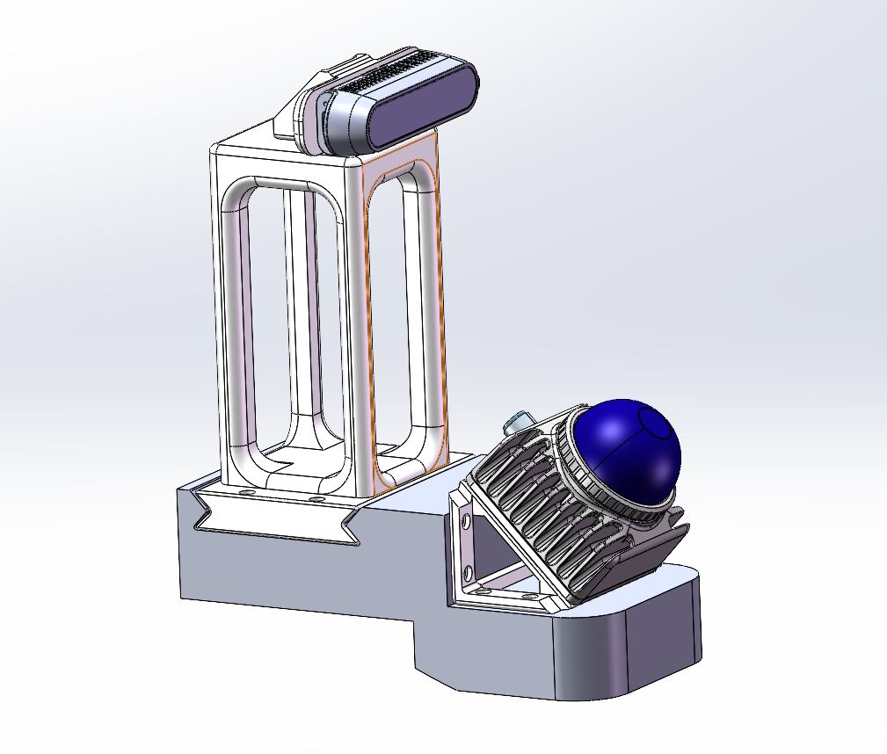

# GO2 EDU Sensor Layout & Quick-Release Mounting Kit

  

  <strong>English</strong> · <a href="README_CN.md">中文</a>

This repository contains a modular 3D sensor-layout and mounting kit for the **Unitree GO2 EDU**. It integrates an **Intel RealSense depth camera** and a **Livox Mid-360 LiDAR** into a compact head-mounted assembly.

The design separates the camera mount, LiDAR mount, quick-release adapter, and GO2 EDU mounting structure so that sensing hardware can be installed, removed, and reconfigured quickly for development, transport, or different payload setups.

> 中文说明请参阅 [README_CN.md](README_CN.md)。

## Highlights

- **Dual-sensor integration** — Dedicated mounting points for a RealSense depth camera and a Mid-360 LiDAR.
- **3D perception-oriented layout** — Designed to account for camera field of view, LiDAR coverage, and clearance from the robot body.
- **Modular architecture** — Individual camera, LiDAR, head-mount, and adapter components can be serviced or replaced independently.
- **Quick-release workflow** — Uses a quick-release adapter for fast installation and removal during testing, transport, and payload changes.
- **Manufacturing-ready assets** — Includes SolidWorks source parts, STL files for 3D printing, and a STEP exchange file.

## Repository Contents

| File | Description |
| --- | --- |
| `Go2EDU-head.SLDPRT` / `Go2EDU-head.STL` | GO2 EDU head / primary mounting structure |
| `camera_support.SLDPRT` / `camera_support.STL` | Camera support structure |
| `realsense_support.SLDPRT` / `realsense_support.STL` | RealSense camera mounting part |
| `lidarsupport1.SLDPRT` / `lidarsupport1.STL` | Mid-360 LiDAR mounting bracket |
| `arc-swiss.SLDPRT` / `arc-swiss.STL` | Quick-release adapter |
| `backborad1.SLDPRT` / `backborad1.STEP` | Rear connection / mounting plate |

## Installation Overview

1. Secure `Go2EDU-head` to the intended GO2 EDU mounting location.
2. Attach and lock the `arc-swiss` quick-release adapter.
3. Fit `realsense_support` and `lidarsupport1` to their respective mounting positions.
4. Install the RealSense camera and Mid-360 LiDAR, then verify that brackets, cables, and the robot body do not obstruct their fields of view.
5. Route and secure all sensor cables with enough slack to prevent interference during robot motion.

## Assembly Hardware List

| Feature / Location | Hardware | Quantity / Usage |
| --- | --- | --- |
| 4 mm holes | M3×5 土八 heat-set inserts | 19 pcs |
| 3.2 mm holes | M3×8 screws | 10 pcs |
| 3.2 mm holes | M3×15 screws | 8 pcs |
| Rear plate | M3×85 screws | 4 pcs, for rear plate fixation |
| Rear-plate rail | Black long screws | For the four front dog-head fixation points |

Install the heat-set inserts in the 4 mm holes and use the M3 screws in the 3.2 mm holes as indicated above. Verify the actual screw length and thread engagement before final tightening.

## Used in Research Projects

This sensor configuration has been used in the following GO2 research systems:

- **[SCAN-Planner](https://github.com/wuyi2121/SCAN-Planner)** — *Spatial Collision-Aware Local Planning for Route-Guided Long-Range Quadruped Navigation*. [Paper (arXiv:2606.19555)](https://arxiv.org/abs/2606.19555)
- **[TravExplorer](https://github.com/wuyi2121/TravExplorer)** — *Cross-Floor Embodied Exploration via Traversability-Aware 3D Planning*. [Paper (arXiv:2605.19958)](https://arxiv.org/abs/2605.19958)

## Manufacturing and Editing

- Use the `.STL` files for 3D-printing trials.
- Edit the `.SLDPRT` source files in SolidWorks to adapt dimensions or interfaces.
- Use `backborad1.STEP` to exchange the rear plate with other CAD tools or assemblies.

## Author and License

Maintained by [zhechen003](https://github.com/zhechen003).

The hardware design files in this repository are licensed under the
[CERN Open Hardware Licence Version 2 – Permissive](LICENSE).

Copyright (c) 2026 zhechen003.

## Safety and Compatibility

Before operating the robot, inspect fasteners, cable routing, payload balance, and sensor visibility. Confirm all mechanical dimensions, fastener specifications, cable routing, and electrical interfaces against the exact GO2 EDU, RealSense, and Mid-360 hardware in use.
